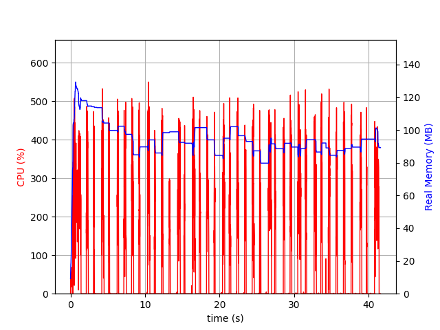

# Spring Boot with GraalVM Performance Comparison

## Description

In this example, we will start the application using JVM and Native Image and compare the performance of both.
Here we will use `psrecord` and `hey` to generate the performance graph and run 500k requests.

### JVM
To generate the performance graph using JVM, use the following command:

```bash
$ make jvm
```
It will generate an image with the result of `500k` requests as below:


### Native Image
To generate the performance graph using Native Image, use the following command:

```bash
$ make native
````
It will generate an image with the result of `500k` requests as below:



## Features
- Java 21
- Spring Boot 3.2.3
- GraalVM
- [psrecord](https://github.com/astrofrog/psrecord)
- [hey](https://github.com/rakyll/hey)

## References
- [native-spring-boot](https://github.com/alina-yur/native-spring-boot)
- [Bootiful GraalVM by Josh Long & Alina Yurenko](https://www.youtube.com/watch?v=3OBhk1c0GBs)
